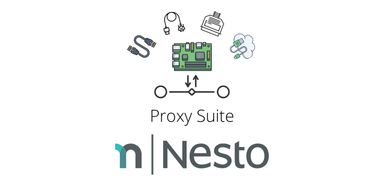
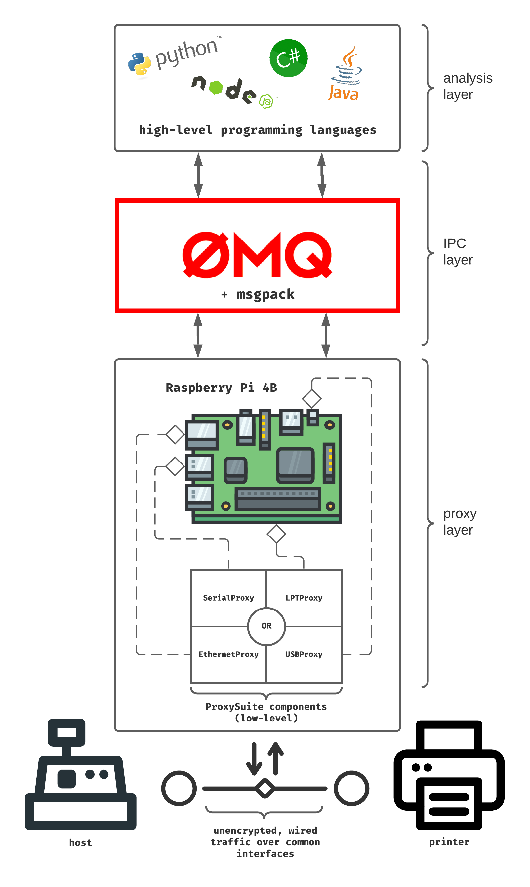

Proxy Suite for Raspberry Pi 4B (armhf)   
========

  

The Proxy Suite is a collection of open-source software which allows intercepting traffic between a target system and its peripherals using a Raspberry Pi 4B device. It is an effort to standardize data exfiltration of (wired) connections between closed-source systems using commodity hardware. The software which is referenced under this umbrella project is a slightly modified version of well-known open-source projects by individual developers and security researchers from all over the world. We at Nesto try to enhance the existing approaches and release our efforts under the same software license as the original project.

Device Support
---------
- **Device**: [Raspberry Pi 4B](https://www.raspberrypi.org/products/raspberry-pi-4-model-b/specifications/)
- **OS:** Linux
- **Distribution**: Raspberry Pi OS / Raspbian (i.e. Debian's packaging system)
- **Architecture**: armhf

Components
---------

<table>

  <tr><th>Component</th><th>Interface Type</th><th>Data Forwarding Component Type</th><th>Status</th></tr>
  
  <tr><td rowspan="2"><a href="https://github.com/nesto-software/USBProxy">USBProxy</a> (based on: <a href="https://github.com/usb-tools/USBProxy-legacy">usb-tools/USBProxy-legacy</a>)</td><td rowspan="2">USB</td><td>Software*</td><td>RTM :heavy_check_mark:</td></tr>
  <tr><td>Hardware <a href="https://luna.readthedocs.io/en/latest/features.html#reference-boards">[LUNA]</a></td><td>PoC :soon:</td></tr>
  
  <tr><td rowspan="2"><a href="https://github.com/nesto-software/EthernetProxy">EthernetProxy</a> (based on: <a href="https://github.com/simsong/tcpflow">simsong/tcpflow</a>)</td><td rowspan="2">Ethernet</td><td>Software</td><td>TBD :gear:</td></tr><tr><td>Hardware <a href="https://www.tp-link.com/us/business-networking/easy-smart-switch/tl-sg105e/">[TL-SG105E]</a><a href="https://greatscottgadgets.com/throwingstar/">[Throwing Star LAN Tap]</a></td><td>RTM :heavy_check_mark:</td></tr>
  
  <tr><td rowspan="2"><a href="https://github.com/nesto-software/SerialProxy">SerialProxy</a> (based on: <a href="http://www.earth.li/projectpurple/progs/sersniff.html">sersniff</a>)</td><td rowspan="2">RS-232</td><td>Software*</td><td>RTM :heavy_check_mark:</td></tr>
  <tr><td>Hardware <a href="https://www.keelog.com/serial-logger/">[AirDrive Serial Logger]</a></td><td>PoC** :warning:</td></tr>

  <tr><td rowspan="2"><a href="https://github.com/nesto-software/LPTProxy">LPTProxy</a> (based on: retro-printer capture code)</td><td rowspan="2">IEEE 1284 (Centronics / LPT)</td><td>Software <a href="https://www.retroprinter.com/">[using retro-printer module]</a></td><td>TBD :gear:</td></tr><tr><td>Hardware***</td><td>--- :question:</td></tr>

</table>
* no special hardware required 
** there are currently issues with the hardware when running proxy for some health check protocols 
*** we are not aware of any solutions on the marked that support this feature
  

We distinguish between a solution which does the actual proxying purely in software (i.e. using the board's CPU) and one which does it in specialized hardware. The latter is generally more performant and robust. Unfortunately, it is not possible to achieve this with commodity hardware for all types of interfaces yet. We keep an eye on active development that is going on though, particularly the teams at [Great Scott Gadgets](https://greatscottgadgets.com/), [Keelog](https://www.keelog.com/software/) and [Retro-Printer](https://www.retroprinter.com/).

Approach
---------

With this project, we want to contribute by...
- ...providing an IPC layer which abstracts away the details of the interface being targeted.
- ...joining forces with the global community of open-source enthusiasts, working on making common peripheral interfaces more accessible for everyone.

Status
--------

We are able to extract data from every non-encrypted wired communication channel between a POS system and its printers that is known to us!

We noticed that wireless connections are rarely used for thermal printers. We can probably work around Wi-Fi (IEEE 802.11) by spawning a custom access point and using EthernetProxy between the AP and the POS. Support for Bluetooth (IEEE 802.15) might be added to this project in the future as we see more and more people using Bluetooth thermal printers. In both wireless cases, we must make sure that traffic flows through the proxy device. Observing traffic passively, like in the hardware approach of the EthernetProxy component, is too risky since we cannot make sure that we see all packets between the target devices.

Applicability
--------

Most thermal printers on the market use the [JetDirect](https://en.wikipedia.org/wiki/JetDirect) or the AppSocket protocol to receive print jobs over the network. It is a simple TCP connection over port 9100, which transports data in plain text. No encryption is used for other transports over interfaces such as USB, Serial, or LPT either. Thus, the ProxySuite components gain access to all of the invoice content transferred between the POS system and its printer. Once the data is intercepted, it can be analyzed as is. The ZMQ layer provided by all ProxySuite components makes the analysis a lot easier by letting you choose the programming language you want to use. There is a clear separation between "low-level" components that extract the data for you and the final analysis, which you might code in any language that has a binding for [ZMQ](http://wiki.zeromq.org/bindings:_start) and [msgpack](https://msgpack.org/).

Releases & Downloads
---------

<table>

  <tr><th>Component</th><th>Release</th><th>Download</th><th>Status</th></tr>

  <tr><td><a href="https://github.com/nesto-software/USBProxy">USBProxy</a></td><td><a href="https://github.com/nesto-software/USBProxy/releases/tag/nightly-latest">nightly</a> <a href="https://github.com/nesto-software/USBProxy/releases/tag/v0.1.0">v0.1.0</a></td><td><code>bash -c "$(curl -fsSL https://raw.githubusercontent.com/nesto-software/USBProxy/master/scripts/install-from-release.sh)"</code></td><td> </td></tr>
  
  <tr><td><a href="https://github.com/nesto-software/EthernetProxy">EthernetProxy</a></td><td><a href="https://github.com/nesto-software/EthernetProxy/releases/tag/latest">latest</a></td><td><code>bash -c "$(curl -fsSL https://raw.githubusercontent.com/nesto-software/EthernetProxy/master/scripts/install-from-release.sh)"</code></td><td></td></tr>
  
  <tr><td><a href="https://github.com/nesto-software/SerialProxy">SerialProxy</a></td><td><a href="https://github.com/nesto-software/SerialProxy/releases/tag/latest">latest</a></td><td><code>bash -c "$(curl -fsSL https://raw.githubusercontent.com/nesto-software/SerialProxy/master/scripts/install-from-release.sh)"</code></td><td></td></tr>
  
  <tr><td><a href="https://github.com/nesto-software/LPTProxy">LPTProxy</a></td><td><a href="https://github.com/nesto-software/LPTProxy/releases/tag/latest">latest</a></td><td><code>bash -c "$(curl -fsSL https://raw.githubusercontent.com/nesto-software/LPTProxy/master/scripts/install-from-release.sh)"</code></td><td></td></tr>
  
</table>

Dependencies & Project Information
---------
<table>

  <tr><th>Component</th><th>Shared Runtime Lib Dependencies (dpkg/apt)</th><th>Programming Language(s)</th><th>Build System(s)</th></tr>

  <tr><td><a href="https://github.com/nesto-software/USBProxy">USBProxy</a></td><td>
  libusb-1.0-0=2:1.0.22-2 
  libudev1=241-7~deb10u5+rpi1 
  libzmq3-dev=4.3.1-4+deb10u2
  </td><td>C/C++</td><td>CMake, Make</td></tr>
  
  <tr><td><a href="https://github.com/nesto-software/EthernetProxy">EthernetProxy</a></td><td>
  libpcap0.8=1.8.1-6 
  openssl=1.1.1d-0+deb10u6+rpt1 
  libzmq3-dev=4.3.1-4+deb10u2
  </td><td>C++</td><td>Autotools, Make</td></tr>
  
  <tr><td><a href="https://github.com/nesto-software/SerialProxy">SerialProxy</a></td><td>
  libzmq3-dev=4.3.1-4+deb10u2
  </td><td>C++</td><td>CMake, Make</td></tr>
  
  <tr><td><a href="https://github.com/nesto-software/LPTProxy">LPTProxy</a></td><td>
  wiringpi=2.50 
  libzmq3-dev=4.3.1-4+deb10u2
  </td><td>C</td><td>CMake, Make</td></tr>
  
</table>

GPG
---------

#### Add our key to your keychain!

We use [GPG](https://de.wikipedia.org/wiki/GNU_Privacy_Guard) to sign our binary releases.
In order to install packages from internal repositories, you must add our key for SecureApt to work.

 

   
<a target="_blank" href="https://www.openkeychain.org/">Download OpenKeychain for Android</a> 
<a target="_blank" href="https://gnupg.org/download/">Download GNU Privacy Guard for Linux</a>
 
 
<b>Keyserver: <a target="_blank" href="https://keys.openpgp.org/search?q=F1C6636C27019FD0D29307DEAE25CBF30C0DDB0C">keys.openpgp.org</a></b>
