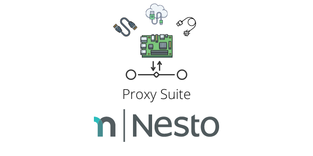

Proxy Suite for Raspberry Pi 4B (armhf)   
========

  

The Proxy Suite is a collection of open-source software which allows to intercept traffic between a target system and its peripherals using a Raspberry Pi 4B device. It is an effort to standardize data exfiltration of (wired) connections between closed-source systems using commodity hardware. The software which is referenced under this umbrella project is a slightly modified version of well-known open-source projects by individual developers and security researchers from all over the world. We at Nesto try to enhance the existing approaches and release our efforts under the same software license as the original project.

Device Support
---------
- **Device**: [Raspberry Pi 4B](https://www.raspberrypi.org/products/raspberry-pi-4-model-b/specifications/)
- **OS:** Linux
- **Distribution**: Raspberry Pi OS / Raspbian (i.e. Debian's packaging system)
- **Architecture**: armhf

Projects
---------

| Project            | Interfaces                                                   |
|:-------------------|:-----------------------------------------------------------------------|
| [**USBProxy**](https://github.com/nesto-software/USBProxy)       | USB (in software)  |
| [**EthernetProxy**](https://github.com/nesto-software/EthernetProxy)  | Ethernet (in hardware)  |
| [**SerialProxy**](https://github.com/nesto-software/SerialProxy)    | RS-232 (in software & hardware)  |

Approach
---------

With this project, we want to contribute by:
- ...providing an IPC layer which abstracts away the details of the interface being targeted.
- ...joining forces with the global community of open-source enthusiasts, working on making common peripheral interfaces more accessible for everyone.

GPG
---------

#### Add our key to your keychain!

We use [GPG](https://de.wikipedia.org/wiki/GNU_Privacy_Guard) to sign our binary releases.
In order to install packages from internal repositories, you must add our key for SecureApt to work.

 

   
<a target="_blank" href="https://www.openkeychain.org/">Download OpenKeychain for Android</a> 
<a target="_blank" href="https://gnupg.org/download/">Download GNU Privacy Guard for Linux</a>
 
 
<b>Keyserver: <a target="_blank" href="https://keys.openpgp.org/search?q=F1C6636C27019FD0D29307DEAE25CBF30C0DDB0C">keys.openpgp.org</a></b>
